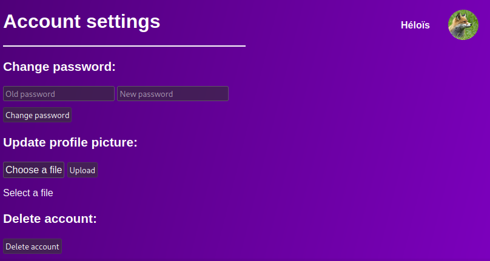
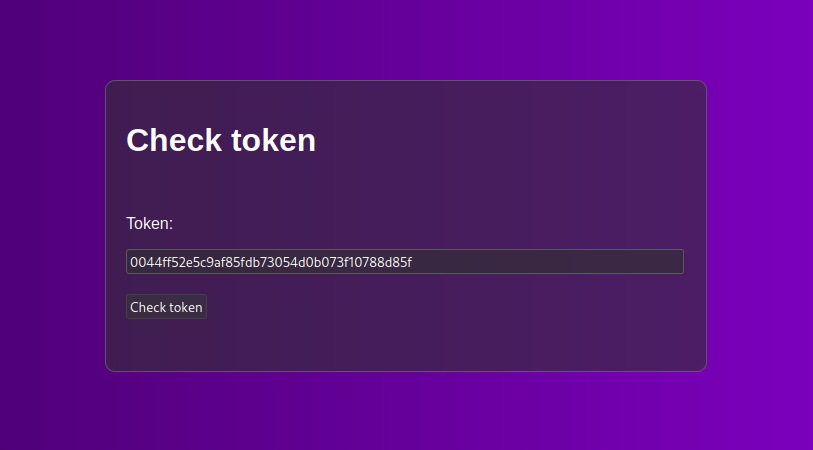
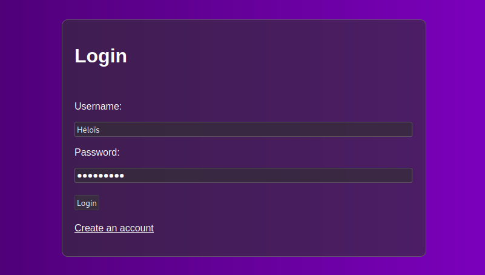
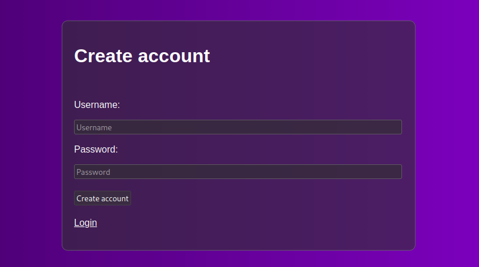
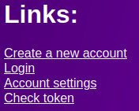

# Fractal account
A simple account management system.\
It can:
- Register new accounts
- Login & provide tokens (valid for 1 hour)
- Completely delete accounts
- Set/update a profile picture

Passwords are hashed using bcrypt + a 16 characters long salt (I think bcrypt already provides a salt but... eh).
# Configuration
There's nothing much to configure. Just create a `.env` file and set `PORT` to whatever port you want the app to listen on.
```dotenv
PORT=4040
```
# Endpoints
A web interface is available, but you can use the API (and the web interface is very far from being the best anyways).\
You have multiple endpoints to interact with the service:

**/deleteaccount**\
Completely deletes an account (database entries + additional data). Example usage:
```js
fetch('/deleteaccount', {
    method: 'POST',
    headers: {
        'Content-Type': 'application/json'
    },
    body: JSON.stringify({
        token: ACCOUNT_TOKEN
    })
});
```
**/getaccountid**\
Gets the ID of an account from a token. Example usage:
```js
fetch('/getaccountid', {
    method: 'POST',
    headers: {
        'Content-Type': 'application/json'
    },
    body: JSON.stringify({
        token: ACCOUNT_TOKEN
    })
});
```
**/uploadprofilepicture**\
Updates the profile picture of an account. Note that in order to use this endpoint, the token must be in the cookies and not in the request. Example usage:
```js
fetch('/uploadprofilepicture', {
    method: 'POST',
    body: formData
});
```
Where the token is in the cookie: `token=ACCOUNT_TOKEN`\
**/getprofile/ACCOUNT_ID**\
Gets the profile picture of an account. Note that it returns an image, not some JSON and doesn't require a token. You can use it as, for example, an image link in some HTML:
```html

```
The profile picture will always be a 200x200 PNG file.\
**/getprofilepicturelink**\
Gets the link of a profile picture from a token. Example usage:
```js
fetch('/getprofilepicturelink', {
    method: 'POST',
    headers: {
        'Content-Type': 'application/json'
    },
    body: JSON.stringify({
        token: ACCOUNT_TOKEN
    })
});
```
**/getusername**\
Gets the username of an account from its token. Example usage:
```js
fetch('/getusername', {
    method: 'POST',
    headers: {
        'Content-Type': 'application/json'
    },
    body: JSON.stringify({
        token: ACCOUNT_TOKEN
    })
});
```
**/updatepassword**\
Updates the password of an account. Requires the account token and its old password. Example usage:
```js
fetch('/updatepassword', {
    method: 'POST',
    headers: {
        'Content-Type': 'application/json'
    },
    body: JSON.stringify({
        oldPassword: OLD_PASSWORD,
        newPassword: NEW_PASSWORD,
        token: ACCOUNT_TOKEN
    })
});
```
**/checktoken**\
Checks if the token of an account is valid or not. Example usage:
```js
fetch('/checktoken', {
    method: 'POST',
    headers: {
        'Content-Type': 'application/json',
    },
    body: JSON.stringify({
        'token': ACCOUNT_TOKEN
    })
});
```
**/updatevidcolor**\
Update the background color of the virtual ID.\
Note that the color field must be a string representing a hex color, for example `#5e7317`. \
Example usage:
```js
fetch('/updatevidcolor', {
    method: 'POST',
    headers: {
        'Content-Type': 'application/json',
    },
    body: JSON.stringify({
        'token': USER_TOKEN,
        'color': NEW_COLOR
    }),
});
```
**/login**\
Gives an account token from an username and password, valid for 1 hour. Example usage:
```js
fetch('/login', {
    method: 'POST',
    headers: {
        'Content-Type': 'application/json',
    },
    body: JSON.stringify({
        'username': ACCOUNT_USERNAME,
        'password': ACCOUNT_PASSWORD
    }),
});
```
**/register**\
Register a new account. Example usage:
```js
fetch('/register', {
    method: 'POST',
    headers: {
        'Content-Type': 'application/json',
    },
    body: JSON.stringify({
        'username': NEW_ACCOUNT_USERNAME,
        'password': NEW_ACCOUNT_PASSWORD
    }),
});
```
Note that this endpoint doesn't return a token, you will have to then login to get it.

**/getusername/USER_ID**\
Gets the username from a user ID. Example usage:
```js
fetch('/getusername/USER_ID');
```
**/vid/USER_ID**\
Gets the vID from a user ID. Example usage:
```html
<iframe src='/vid/USER_ID' style='height: 250px; width: 400px;'></iframe>
```
**/vidpng/USER_ID**\
Returns a rendered PNG of `/vid/USER_ID`. Example usage:
```html
</img>
```

If you want to see how these endpoints can be used, you can view the web interface's JavaScript source code (in `./public/js/`).
# The web interface
The web interface is pretty basic and doesn't do much. With it, you can login, register a new account, check if a token is valid and change its settings.

**Change an account's settings:**\
You can do that in `/accountsettings`. You need to be logged in.\


**Check a token:**\
You can check if a token is valid or not in `/tokenchecker`.


**Login:**\
You can login in `/login`.


**Register:**\
You can register a new account in `/createaccount`.


By default, `/` returns a list of every links.\


# Additional notes
A logo can be found on the bottom left of vIDs. Feel free to change it if you wish by modifying `./public/assets/vid-logo.png`!
